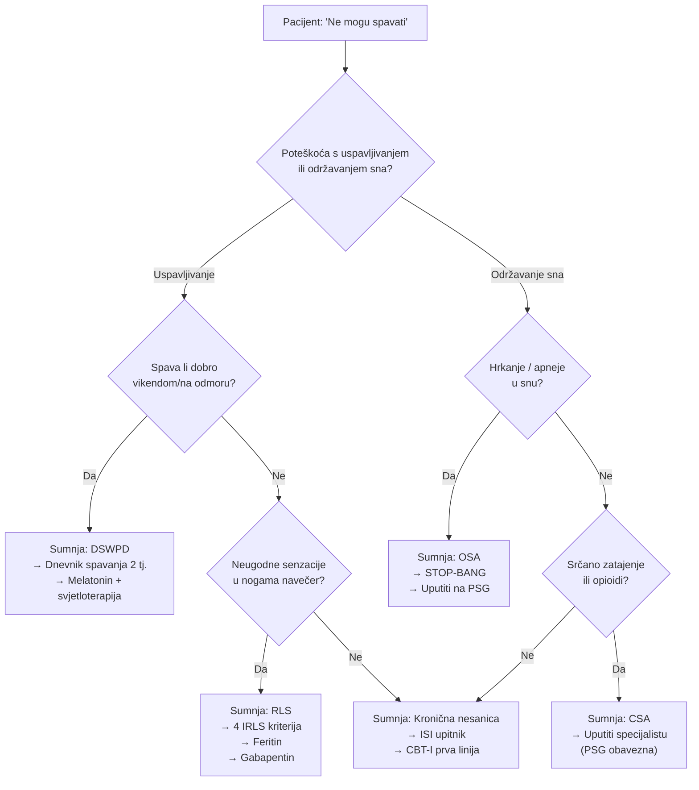
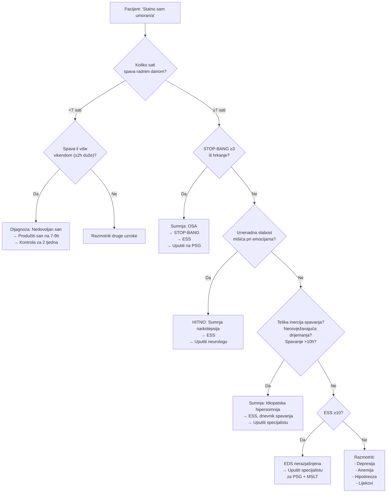
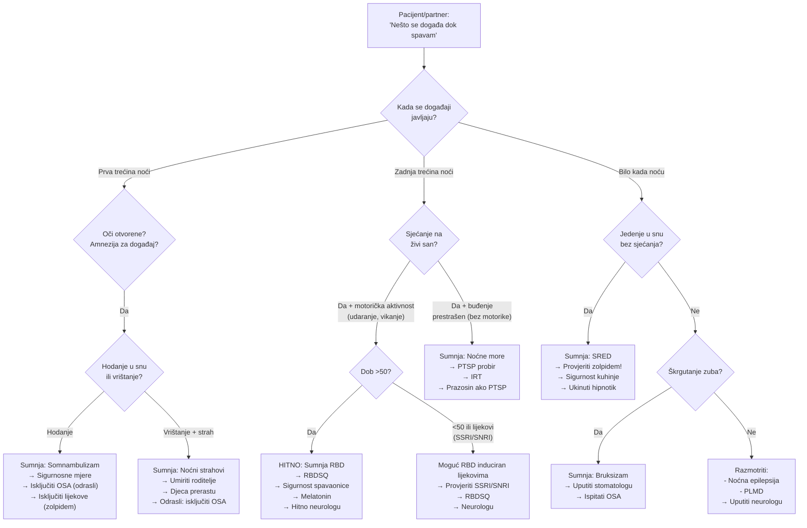

# Klinički dijagnostički algoritmi za poremećaje spavanja

> **Namjena:** Obiteljski liječnici u primarnoj zdravstvenoj zaštiti u Hrvatskoj
> **Format:** Mermaid dijagrami — renderirani u bilo kojem Markdown pregledniku koji podržava Mermaid (GitHub, Obsidian, VS Code, itd.)
> **Verzija:** 1.0 | Datum: 2026-02-22

---

## Legenda oblika i oznaka

| Oblik | Značenje |
|-------|----------|
| **Zaobljeni pravokutnik** `([ ])` | Početna pritužba pacijenta |
| **Romb** `{ }` | Klinička odluka / pitanje za liječnika |
| **Pravokutnik** `[ ]` | Radna dijagnoza + sljedeći korak |
| **Crveni tekst "HITNO"** | Zahtijeva žurnu uputnicu specijalistu |

**Kratice korištene u dijagramima:**

| Kratica | Puni naziv |
|---------|-----------|
| CBT-I | Kognitivno-bihevioralna terapija za nesanicu |
| CSA | Centralna apneja u snu |
| DSWPD | Poremećaj odgođene faze spavanja (Delayed Sleep-Wake Phase Disorder) |
| EDS | Prekomjerna dnevna pospanost (Excessive Daytime Sleepiness) |
| ESS | Epworthova ljestvica pospanosti |
| IRT | Terapija prepisivanja slika (Imagery Rehearsal Therapy) |
| ISI | Indeks težine nesanice (Insomnia Severity Index) |
| MSLT | Test višestrukih latencija spavanja |
| OSA | Opstruktivna apneja u snu |
| PLMD | Poremećaj periodičkih pokreta udova |
| PSG | Polisomnografija |
| PTSP | Posttraumatski stresni poremećaj |
| RBD | REM poremećaj ponašanja u snu |
| RBDSQ | RBD Screening Questionnaire |
| RLS | Sindrom nemirnih nogu (Restless Legs Syndrome) |
| SRED | Poremećaj jedenja povezan sa spavanjem (Sleep-Related Eating Disorder) |
| STOP-BANG | Upitnik probira za OSA |

---

## 1. "Ne mogu spavati" — Algoritam za nesanicu i otežano spavanje

Ovaj algoritam vodi liječnika od inicijalne pritužbe "Ne mogu spavati" do radne dijagnoze kroz sustavno razlikovanje poremećaja uspavljivanja od poremećaja održavanja sna.

### Napomene za korištenje

1. **Prva odlučna točka — uspavljivanje vs. održavanje sna.** Ovo je ključno razlikovanje jer usmjerava na potpuno različite dijagnostičke putanje. Mnogi pacijenti imaju oba problema — u tom slučaju počnite s dominantnom pritužbom, ali provjerite obje grane.

2. **DSWPD vs. kronična nesanica.** Kritično pitanje je spava li pacijent normalno vikendom ili na odmoru. Ako da, biološki sat je pomaknut, ali sustav spavanja je intaktan. Ovo je čest nalaz u mlađih pacijenata (15–30 god.) i često se pogrešno dijagnosticira kao nesanica.

3. **Sindrom nemirnih nogu (RLS).** Četiri dijagnostička kriterija prema IRLSSG:
   - Nagon za pomicanjem nogu, obično praćen neugodnim senzacijama
   - Pogoršanje u mirovanju
   - Poboljšanje pokretom
   - Pogoršanje navečer ili noću
   Uvijek provjerite **feritin** — ako je < 75 µg/L, suplementacija željezom može riješiti simptome.

4. **OSA kao uzrok fragmentiranog sna.** Pacijenti s OSA često ne znaju da hrkaju niti da imaju apneje. Pitajte partnera. STOP-BANG ≥ 3 zahtijeva daljnju evaluaciju.

5. **Centralna apneja u snu (CSA).** Rijetka, ali opasna. Uvijek pitajte o srčanom zatajenju (osobito HFrEF), upotrebi opioida i nedavnom cerebrovaskularnom inzultu. CSA zahtijeva PSG i specijalistički pristup — ne liječiti u primarnoj zaštiti.

6. **Kronična nesanica — CBT-I kao prva linija.** Prema europskim (ESRS) i američkim (AASM) smjernicama, kognitivno-bihevioralna terapija za nesanicu (CBT-I) je prva linija liječenja. Hipnotici (zolpidem, benzodiazepini) su **samo kratkoročno** i **nikada kao monoterapija**.

---

## 2. "Stalno sam umoran/a" — Algoritam za prekomjernu dnevnu pospanost

Ovaj algoritam razlikuje nedovoljan san od pravih poremećaja hipersomnolencije i usmjerava na prepoznavanje narkolepsije kao hitnog stanja.

### Napomene za korištenje

1. **Prvo pravilo: isključite nedovoljan san.** Ovo je daleko najčešći uzrok dnevne pospanosti u općoj populaciji. Pitanje o vikend spavanju otkriva "dug sna" — ako pacijent vikendom spava ≥ 2 sata duže, tijelo nadoknađuje kroničan deficit. Rješenje je jednostavno: produžiti san na 7–9 sati. Kontrola za 2 tjedna potvrđuje ili opovrgava dijagnozu.

2. **OSA je drugi najčešći uzrok.** Čak i pacijenti koji spavaju "dovoljno" mogu imati fragmentiran san zbog OSA. STOP-BANG upitnik i pitanje o hrkanju su brzi probir. Propisati ESS prije upućivanja na PSG.

3. **Narkolepsija — HITNA uputnica.** Katapleksija (iznenadna mišićna slabost potaknuta emocijama — smijeh, iznenađenje, ljutnja) je patognomonična za narkolepsiju tipa 1. Ovo je rijetko (prevalencija ~1:2000), ali liječnici u primarnoj zaštiti su često prvi koji vide ove pacijente. Prosječno kašnjenje dijagnoze je **8–15 godina**. Uputite odmah neurologu — ne čekajte.

4. **Idiopatska hipersomnija.** Tri ključna znaka:
   - Teška inercija spavanja ("sleep drunkenness") — pacijent se teško budi, konfuzan je 30–60 minuta
   - Duga drijemanja koja ne osvježavaju
   - Ukupno spavanje > 10 sati u 24 sata
   Dijagnoza zahtijeva PSG + MSLT u specijaliziranom centru.

5. **ESS kao alat za probir.** Epworthova ljestvica pospanosti ≥ 10 ukazuje na klinički značajnu dnevnu pospanost. Koristite je kao objektivnu mjeru prije upućivanja specijalistu.

6. **Diferencijalna dijagnoza na kraju algoritma.** Ako pacijent spava dovoljno, nema OSA, nema znakove narkolepsije ni idiopatske hipersomnolencije, i ESS je < 10, razmislite o:
   - **Depresiji** (PHQ-9 upitnik)
   - **Anemiji** (KKS, feritin)
   - **Hipotireozi** (TSH)
   - **Lijekovima** (antihistaminici, benzodiazepini, antiepileptici, opioidi, beta-blokatori)

---

## 3. "Nešto se događa dok spavam" — Algoritam za parasomnije i noćne događaje

Ovaj algoritam razlikuje parasomnije NREM spavanja (prva trećina noći) od parasomni REM spavanja (zadnja trećina noći), uz poseban naglasak na RBD kao urgentno stanje.

### Napomene za korištenje

1. **Vremenska raspodjela noći je ključna.** Prva trećina noći dominirana je dubokim NREM spavanjem (stadij N3) — parasomnije u tom periodu su NREM parasomnije (somnambulizam, noćni strahovi). Zadnja trećina noći dominirana je REM spavanjem — događaji u tom periodu sugeriraju REM parasomnije (RBD, noćne more). Ovo jednostavno pitanje ("Kada se to događa?") odmah sužava diferencijalnu dijagnozu.

2. **Amnezija razlikuje NREM od REM parasomni.** Pacijenti s NREM parasomnijama tipično nemaju sjećanje na događaj i imaju otvorene oči s "praznim" pogledom. Pacijenti s REM parasomnijama obično pamte žive snove.

3. **RBD — HITNA uputnica iz dva razloga:**
   - **Sigurnosni rizik:** Pacijent može ozlijediti sebe ili partnera (udarci, padovi iz kreveta)
   - **Neurodegenerativni prodrom:** Idiopatski RBD u osoba > 50 godina konvertira u alfa-sinukleinopatiju (Parkinsonova bolest, demencija s Lewyjevim tjelešcima, MSA) u **> 80% slučajeva** unutar 10–15 godina. Rana neurološka evaluacija omogućuje praćenje i eventualno uključivanje u kliničke studije neuroprotektivne terapije.
   - **RBDSQ** (REM Sleep Behavior Disorder Screening Questionnaire) — brzi upitnik (raspon 0–10), rezultat ≥5 sugerira RBD.

4. **RBD induciran lijekovima.** SSRI i SNRI antidepresivi (fluoksetin, venlafaksin, duloksetin) mogu provocirati RBD. U pacijenata < 50 godina s RBD simptomima, uvijek provjerite farmakoterapiju. Ukidanje ili zamjena antidepresiva može riješiti problem, ali neurološka evaluacija je i dalje potrebna jer lijekovima induciran RBD može demaskirati latentnu sinukleinopatiju.

5. **Noćne more i PTSP.** Učestale noćne more su čest simptom PTSP-a. Koristite PCL-5 ili sličan instrument za probir. Terapija prvog izbora je **IRT** (Imagery Rehearsal Therapy) — pacijent prepisuje završetak sna u budnom stanju. **Prazosin** (alfa-1 antagonist, 1–15 mg navečer) ima dokaze za PTSP-asocirane noćne more, ali rezultati novijih studija su miješani.

6. **SRED i zolpidem.** Poremećaj jedenja povezan sa spavanjem (SRED) često je induciran zolpidemom. Pacijent ustaje noću, jede (ponekad neobične ili opasne tvari), i nema sjećanje. Prvi korak: utvrdite koristi li pacijent hipnotik i ukinite ga.

7. **Bruksizam i OSA.** Bruksizam u snu nije samo stomatološki problem. U značajnom postotku slučajeva, bruksizam je sekundaran OSA-i — mikrobuđenja na kraju apneje aktiviraju žvačnu muskulaturu. Uputite stomatologu za udlagu, ali ispitajte i OSA (osobito ako postoji hrkanje ili EDS).

---

## Opće napomene za sve algoritme

### Kada uputiti specijalistu čak i bez jasne dijagnoze

Ovi algoritmi pokrivaju najčešće poremećaje spavanja, ali ne mogu zamijeniti kliničku prosudbu. **Uputite pacijenta specijalistu za medicinu spavanja ili neurologu** u sljedećim situacijama:

- **Simptomi ne odgovaraju ni jednoj grani algoritma** — neobični simptomi, atipična prezentacija
- **Terapija prvog izbora ne pomaže nakon 4–6 tjedana** — nesanica perzistira unatoč CBT-I, pospanost unatoč dovoljno sna
- **Sumnja na više istovremenih poremećaja** — npr. OSA + nesanica (COMISA)
- **Profesionalni vozači, piloti, strojovođe** — bilo kakva sumnja na poremećaj spavanja zahtijeva objektivnu evaluaciju (PSG) zbog sigurnosnih implikacija
- **Pedijatrijski pacijenti** s poremećajima spavanja — osobito sumnja na OSA u djece (kliničke smjernice se razlikuju od odraslih)
- **Trudnice** s hrkanjem ili pospanosti — OSA u trudnoći povećava rizik za preeklampsiju i fetalne komplikacije
- **Pacijenti sa psihijatrijskim komorbiditetom** — poremećaji spavanja i psihijatrijski poremećaji su bidirekcionalno povezani; liječenje jednog bez drugog rijetko uspijeva

### Dostupni centri za medicinu spavanja u Hrvatskoj

Uputnice se šalju prema lokalnoj dostupnosti. Glavni centri:

- **KBC Zagreb** — Centar za medicinu spavanja (Klinika za plućne bolesti Jordanovac)
- **KBC Split** — Laboratorij za spavanje (Klinika za neurologiju)
- **KBC Rijeka** — Polisomnografija (Klinika za neurologiju)
- **KB Dubrava, Zagreb** — Laboratorij za spavanje
- **KBC Osijek** — Polisomnografija (Klinika za neurologiju)

### Napomena o validaciji

Ovi algoritmi bazirani su na:
- ICSD-3 (International Classification of Sleep Disorders, 3rd edition)
- AASM Clinical Practice Guidelines
- European Sleep Research Society (ESRS) smjernice
- Prilagođeni za kontekst hrvatskog zdravstvenog sustava

Algoritmi su namijenjeni kao **klinička potpora odlučivanju**, a ne zamjena za kliničku prosudbu. U slučaju dijagnostičke dvojbe, uvijek uputite specijalistu.
